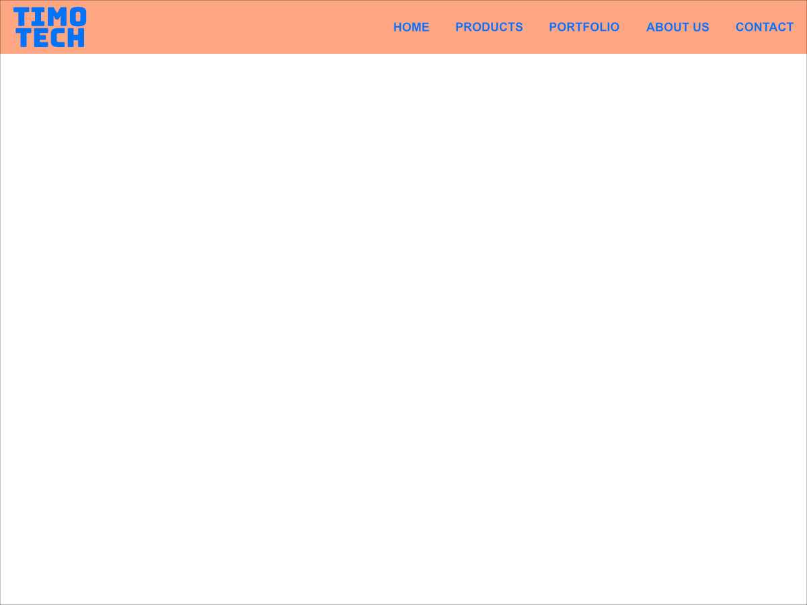

# Lesson 1 - Navigation bar
1. Set font size on HTML element to 100% and font-familu to "Helvetica, Arial, sans-serif"
2. Wrap the header elements in a header
3. Wrap the ul/list in a nav element and set font size on links to 1.2rem
4. Align the nav elements on the same line to make a menu
5. Set the menu text color to #0072F5 
6. Set the background of the header to #FEA581

**Resources**

(https://developer.mozilla.org/en-US/docs/Web/CSS/CSS_Flexible_Box_Layout/Typical_Use_Cases_of_Flexbox)

(https://css-tricks.com/snippets/css/a-guide-to-flexbox/)